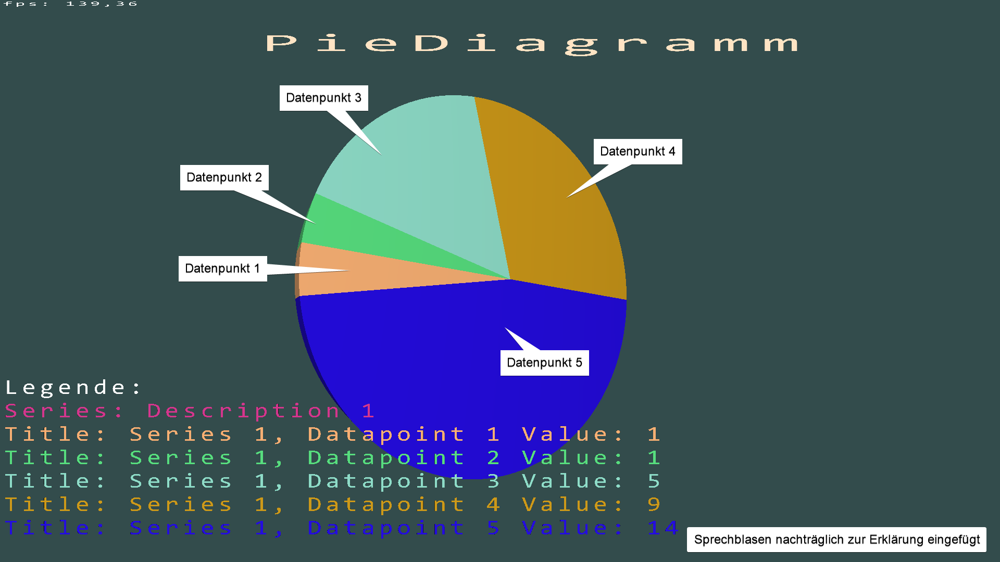
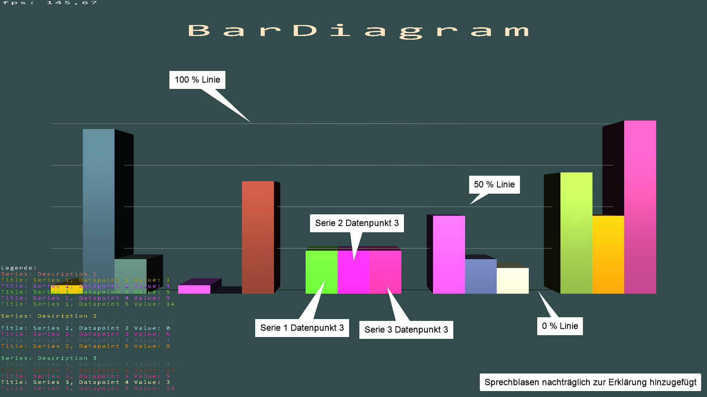
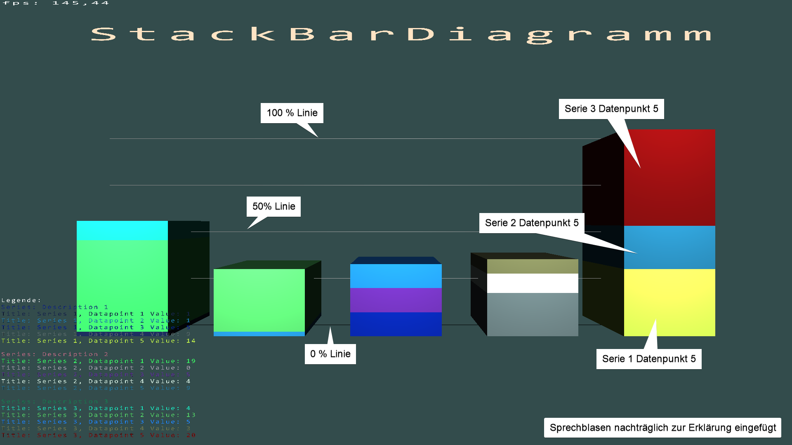

**CG-Kürteil 2022 3D-Diagramme Florian Symmank 578767**

- Sprache: C#, net 6.0  
- OpenGL via OpenTK 4.7.2
- Tutorial: https://opentk.net/learn/index.html (Shader.cs, Camera.cs, shader.frag und shader.vert mit geringen Änderungen übernommen)
- GitHub: https://github.com/FlorianSymmank/CG_Kuerteil
- Showcase: https://youtu.be/5rJ6pEr346g / [Showcase.mp4](showcase.mp4)

## Funktionen: 3 Diagrammtypen  
3D Darstellung verschiedener Diagrammarten: PieDiagramm, BarDiagramm, StackBardDiagramm

## PieDiagramm  
PieDiagramm kann eine Serie von Datenpunkten darstellen.

## BarDiagramm
BarDiagramm stellt mehrere Serien und ihre Datenpunkte gruppiert nebeneinander dar. Kann negative Werte anzeigen.

## StackBardDiagramm
StackBardDiagramm stellt die Datenpunkte mehrerer Serien gruppiert übereinander dar.

